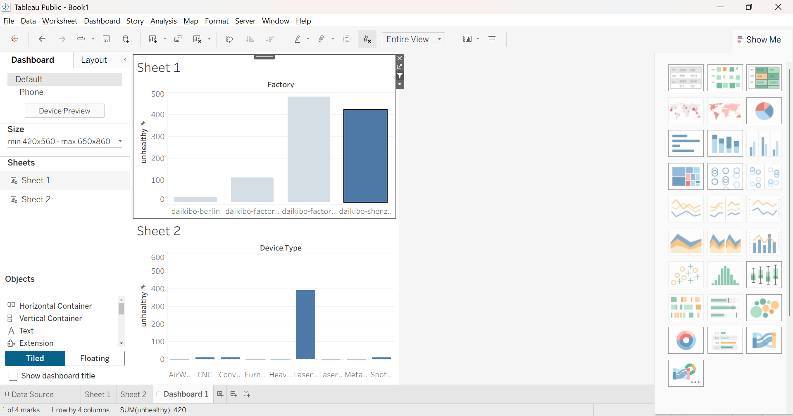

# Factory Downtime Tableau Analysis

This project analyzes factory telemetry data to identify machine downtime using Tableau.

## Dashboard Preview

## Tools Used
- Tableau Public
- JSON Dataset
- Data Visualization

## Project Structure
factory-downtime-tableau-analysis
│
├── daikibo-telemetry-data.zip
├── factory-downtime-analysis.twbx
├── dashboard.png
└── README.md

## Key Insights
- Daikibo Factory Meiyo has the highest machine downtime.
- Laser device type contributes the most to downtime.
- The dashboard helps identify operational inefficiencies across factories.

## Author
Jeet Saha  
CSE (Data Science)  
Techno India University
